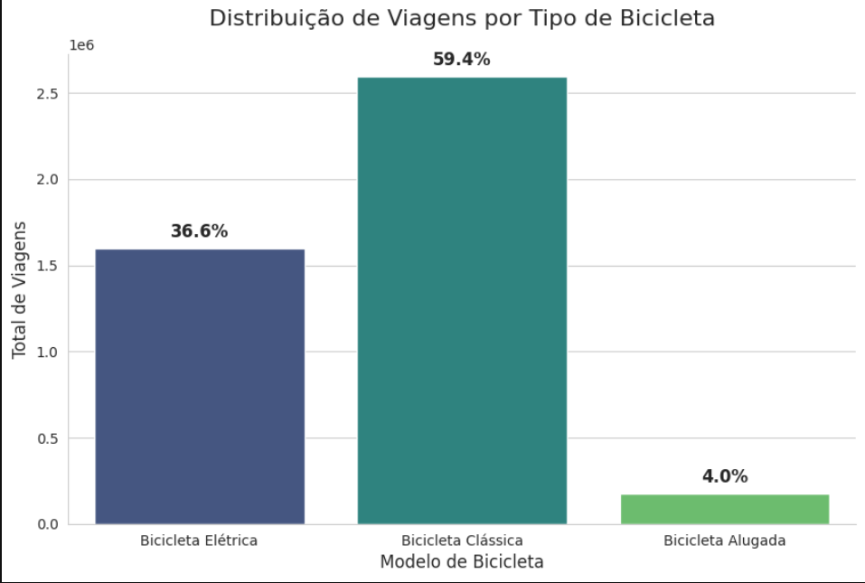
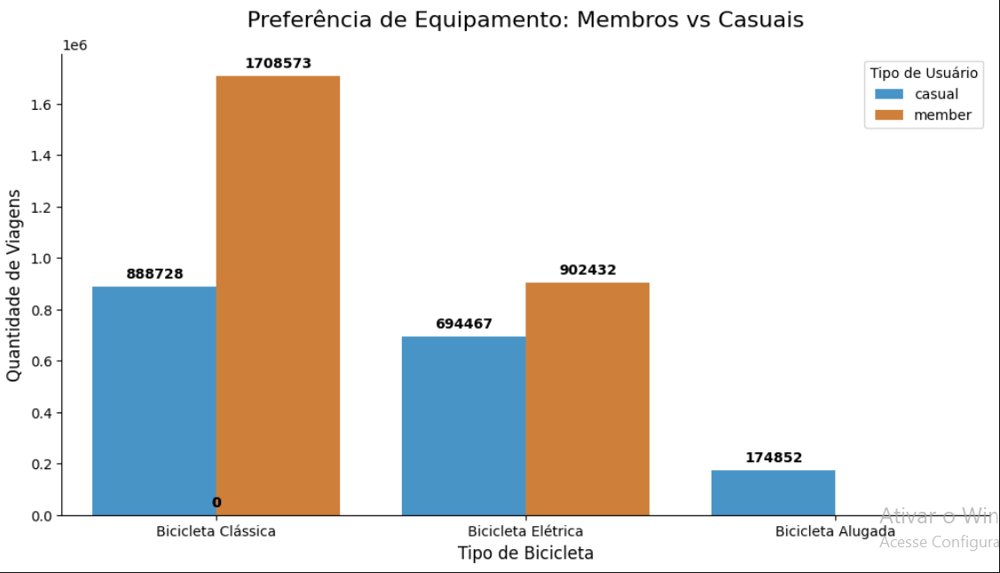
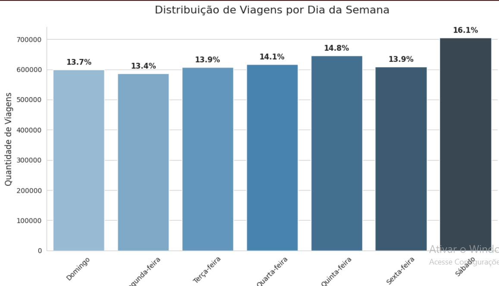
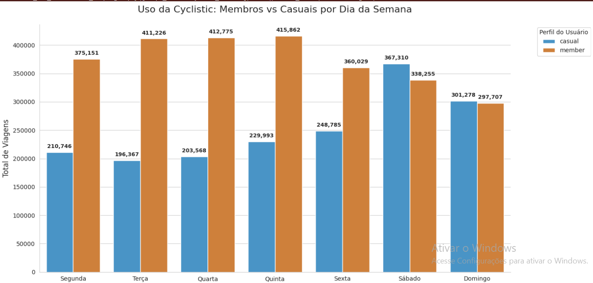
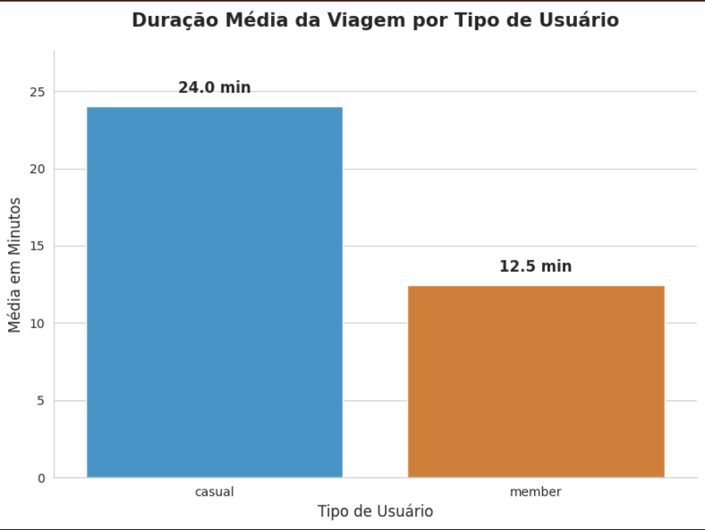
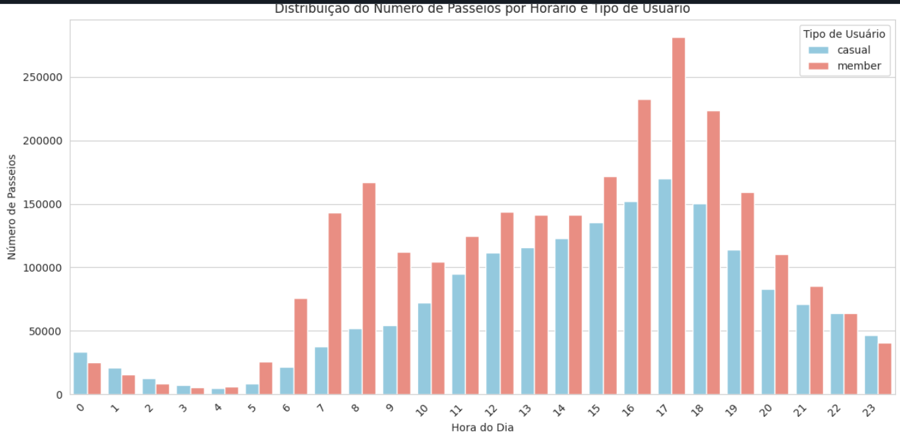

# 🚴 Cyclistic Bike Share Analysis

Business Case desenvolvido durante o Google Data Analytics Professional Certificate utilizando Python, SQL, Excel e Power BI para gerar insights de negócio para a empresa Cyclistic.

## Índice

- [Introdução](#introdução)
- [Tecnologias](#tecnologias)
- [Dataset](#dataset)
- [Processo ETL](#processo-etl)
- [Limpeza dos Dados](#limpeza-dos-dados)
- [Análise Exploratória](#análise-exploratória)
- [Perguntas de Negócio](#perguntas-de-negócio)
- [Insights](#insights)
- [Conclusão e recomendacao](#conclusão-e-recomendacao)
- [Autor](#autor)

## Introdução

Este projeto foi desenvolvido como parte do Google Data Analytics Professional Certificate.

O objetivo foi analisar o comportamento dos usuários da empresa fictícia Cyclistic para identificar diferenças entre membros anuais e clientes casuais, propondo estratégias para aumentar a conversão de usuários ocasionais em assinantes.

## Tecnologias

- Python
- Pandas
- NumPy
- Matplotlib
- SQL
- Excel
- Power BI
- GitHub

## Dataset

Fonte de dados: Dados públicos da Motivate International Inc. (Serviço de compartilhamento de bicicletas Divvy de Chicago);

[Dados Historicos](https://divvy-tripdata.s3.amazonaws.com/index.html) de viagens de ciclistas (de 2013 em diante) disponíveis em no formato .csv.

Intervalo dos dados da análise: janeiro a dezembro de 2021 (1 GB, descompactado);

O conjunto de dados possui registros individuais de uso de bicicletas compartilháveis que constam de data e hora de início e término do passeio, latitude e longitude, informações da estação, tipo de bicicleta e tipo de ciclista (casual/membro).

## Processo ETL

✔ Importação dos arquivos

✔ Remoção de valores nulos

✔ Tratamento de datas

✔ Padronização das colunas

✔ Criação de novas variáveis

✔ Exportação do dataset tratado

O passo a passo detalhado do desenvolvimento e a execução do código podem ser visualizados diretamente no [Notebook de Análise](Notebooks/projeto_cicle_versao_final.ipynb).

## Limpeza dos Dados

Processo de limpeza: No processo foram apagadas:

Linhas com nomes de estação inicial e final ausentes encontradas;

Outras colunas que não possuiam utilidade para esta análise;

Valores de duração de viagem negativos, zerados e abaixo de 1.

Após a limpeza e consolidação dos dados em uma tabela, foram retornadas 4.270.103 linhas para a análise.

## Análise Exploratória

Foram analisados os dados de viagem de aproximadamente 4.2 milhões de registros de passeio no conjunto de dados final. Para observar tendências diferenciadas entre o uso por usuários casuais e membros anuais, foram desenvolvidas visualizações diretamente no Google colab. Estes mesmos gráficos podem ser acessados de uma forma mais interativa nesse Dashboard desenvolvido no Microsoft Power BI.

### Membros x Casuais

Analise:

Podemos observar que a base de usuários é composta por 59% de membros, que garantem receita recorrente, enquanto mais de 40% são casuais, representando nossa maior oportunidade de expansão de assinaturas.

### Tipos de equipamentos

Analise: 

Podemos visualizar que a preferencia de uso tanto para Membros quanto para casuais ainda é a bicicleta tradicional.

### Uso das bicicletas durante a semana:

Analise:  

Podemos ver que o dia que o servico de aluguel das bicicletas é mais utilizado no sabado. Vamos analisar tipo de usuario x dia da semana

Analise:

 - É bem evidente que os passeios feitos por ciclistas casuais atingem o pico durante o fim de semana em comparação com os membros anuais, que permanecem relativamente estáveis.

 - Ao analisar as médias de ciclistas casuais, é notado que a média do final de semana é em torno de 35% maior que a média de meio de semana.

 - A análise das médias de ciclistas membros nota que a média de final de semana é em em torno de 19% menor que a média do meio de semana.

 - Isso pode indicar que os ciclistas casuais priorizam o aluguel de bicicletas para fins de lazer.

 ### Duração media dos passeios:

Analise:

- A duração média do passeio dos ciclistas casuais é quase o dobro da média dos cisclistas membros.

- Isso pode reforçar a tese de que os ciclistas casuais usam o aluguel de bicicletas priorizando o lazer.

Analise: 

A diferença proporcional de ciclistas casuais e membros começa a cair no início da noite, se iguala às 22 horas e segue a madrugada com proporções bem semelhantes até às 4 da manhã.

Após esse horário os membros superam os ciclistas sociais. Os ciclistas fazem a maior parte dos passeios durante os horários de expediente e decrescem com a chegada da noite.

Esse dado corrobora com a hipótese de que os ciclistas casuais usam o aluguel de bicicletas para fins de lazer, enquanto os membros usam para irem ao trabalho.

## Perguntas de Negócio

Este projeto de análise dos dados de viagens da Cyclistic, uma empresa de compartilhamento de bicicletas, com o objetivo de entender as diferenças no comportamento entre membros anuais e ciclistas casuais. A análise se concentra em identificar padrões de uso, como duração das viagens, horários e dias da semana preferidos, e tipo de bicicleta utilizada. As informações obtidas serão utilizadas para responder às seguintes perguntas:

1 - Como os membros anuais e os ciclistas casuais usam as bicicletas da Cyclistic de forma diferente?

Perfil Utilitário (Membros): O uso é focado em transporte funcional (commuting). Os dados mostram picos claros entre 08h-09h e 17h-18h em dias úteis, com durações de viagem curtas e constantes (12-14 min). Eles usam a Cyclistic como uma extensão do transporte público.

Perfil Recreativo (Casuais): O uso é focado em lazer e bem-estar. O volume explode nos fins de semana e durante o Verão. As viagens são significativamente mais longas, durando em média 2x mais (21-28 min) que as dos membros, indicando passeios turísticos ou de exploração.

2 - Por que os passageiros casuais iriam querer adquirir planos anuais da Cyclistic?

Previsibilidade de Custo: Como os casuais realizam viagens longas, o custo por minuto ou passe diário acaba sendo superior ao valor diluído de uma anuidade.

Conveniência e Acesso Ilimitado: A análise de sazonalidade mostra que o usuário casual é recorrente durante os 4-5 meses de calor. O plano anual pode ser vendido como um "Acesso VIP de Verão", eliminando a fricção de ter que pagar a cada novo uso.

Benefício de Ativo: Se a análise mostrar que eles preferem as Bicicletas Elétricas, o plano anual pode oferecer taxas reduzidas ou prioridade de reserva para esses ativos.

3 - Como a Cyclistic pode usar a mídia digital para influenciar os passageiros casuais a se tornarem membros?

Campanhas Geolocalizadas (Onde): Focar anúncios em redes sociais (Instagram/Facebook) com geofencing nas Top 10 Estações de Lazer (identificadas no seu Mapa/Matriz), especialmente as próximas a parques e orlas.

Timing Estratégico (Quando): Intensificar o tráfego pago nas manhãs de Sexta-feira e tardes de Domingo, antecipando o comportamento de lazer do fim de semana.

Mensagem Personalizada (Como): Utilizar anúncios que destaquem o "Estilo de Vida Ativo". Em vez de vender um "transporte", vender a "liberdade de explorar a cidade no verão sem se preocupar com o tempo de viagem".

## Insights

• Usuários casuais utilizam bicicletas principalmente nos finais de semana.

• Membros anuais apresentam comportamento consistente durante toda a semana.

• O verão concentra o maior volume de viagens.

• Bicicletas clássicas são as mais utilizadas.

• Usuários casuais realizam viagens com maior duração de tempo.

## Conclusão e recomendacao

Uma observação comum é que os ciclistas casuais estão usando o aluguel de bicicletas para fins de lazer e turismo, enquanto os membros anuais a utilizam predominantemente para fins de deslocamento, como ir ao trabalho ou outras atividades rotineiras.

Estratégias de marketing devem ser aplicadas em locais tipicamente utilizados para atividades de lazer: como parques, teatros, restaurantes, hoteis e cafés.

Com a informação de que os ciclistas casuais usam as bicicletas por periodos de tempo mais longos, seria interessante campanhas focadas em custo/benefício para essa categoria.

Notificações em redes sociais e mensagens de texto em horários de baixo movimento de ciclistas casuais podem ser usadas para atraí-los.

Campanhas nos finais de semana e nas estações outono, primavea e verão, podem ajudar a aumentar os números durante esse período. Pois o potencial de crescimento de novos membros é enorme.

Promoções aplicadas nos meses de inverno, em dias com temperaturas menos rigorosas, talvez combinada com feriados ou Natal, podem ajudar a aumentar os números nesse periodo.

## Autor

**Rafael Rodrigues Nunes**

Analista de Dados | Logística | Power BI | SQL | Python

LinkedIn

GitHub

Email

