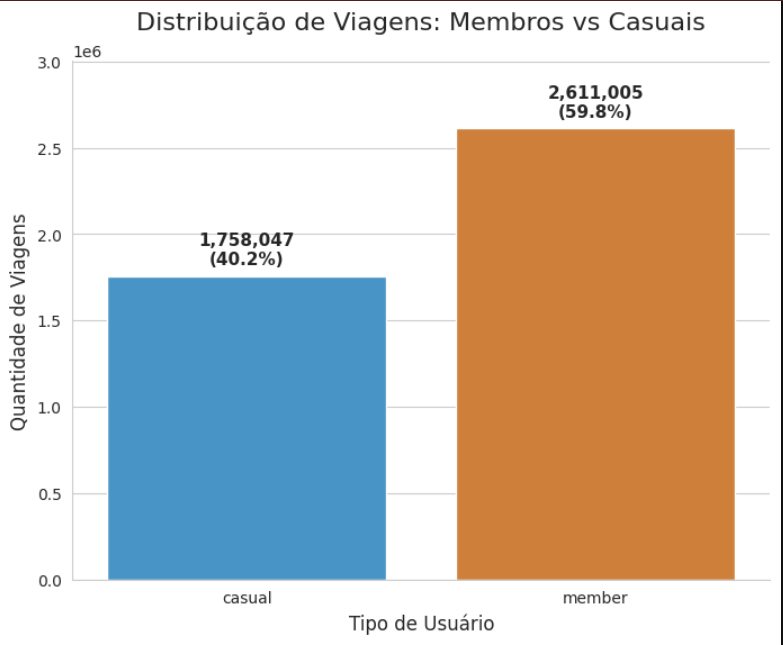

# 🚴 Cyclistic Bike Share Analysis

Business Case desenvolvido durante o Google Data Analytics Professional Certificate utilizando Python, SQL, Excel e Power BI para gerar insights de negócio para a empresa Cyclistic.

## Índice

- [Introdução](#introdução)
- [Tecnologias](#tecnologias)
- [Dataset](#dataset)
- [Processo ETL](#processo-etl)
- [Limpeza dos Dados](#limpeza-dos-dados)
- [Análise Exploratória](#análise-exploratória)
- [Perguntas de Negócio](#perguntas-de-negócio)
- [Dashboard](#dashboard)
- [Insights](#insights)
- [Conclusão](#conclusão)
- [Autor](#autor)

## Introdução

Este projeto foi desenvolvido como parte do Google Data Analytics Professional Certificate.

O objetivo foi analisar o comportamento dos usuários da empresa fictícia Cyclistic para identificar diferenças entre membros anuais e clientes casuais, propondo estratégias para aumentar a conversão de usuários ocasionais em assinantes.

## Tecnologias

- Python
- Pandas
- NumPy
- Matplotlib
- SQL
- Excel
- Power BI
- GitHub

## Dataset

Fonte de dados: Dados públicos da Motivate International Inc. (Serviço de compartilhamento de bicicletas Divvy de Chicago);

[Dados Historicos](https://divvy-tripdata.s3.amazonaws.com/index.html) de viagens de ciclistas (de 2013 em diante) disponíveis em no formato .csv.

Intervalo dos dados da análise: janeiro a dezembro de 2021 (1 GB, descompactado);

O conjunto de dados possui registros individuais de uso de bicicletas compartilháveis que constam de data e hora de início e término do passeio, latitude e longitude, informações da estação, tipo de bicicleta e tipo de ciclista (casual/membro).

## Processo ETL

✔ Importação dos arquivos

✔ Remoção de valores nulos

✔ Tratamento de datas

✔ Padronização das colunas

✔ Criação de novas variáveis

✔ Exportação do dataset tratado

O passo a passo detalhado do desenvolvimento e a execução do código podem ser visualizados diretamente no [Notebook de Análise](Notebooks/projeto_cicle_versao_final.ipynb).

## Limpeza dos Dados

Processo de limpeza: No processo foram apagadas:

Linhas com nomes de estação inicial e final ausentes encontradas;

Outras colunas que não possuiam utilidade para esta análise;

Valores de duração de viagem negativos, zerados e abaixo de 1.

Após a limpeza e consolidação dos dados em uma tabela, foram retornadas 4.270.103 linhas para a análise.

## Análise Exploratória

Foram analisados os dados de viagem de aproximadamente 4.2 milhões de registros de passeio no conjunto de dados final. Para observar tendências diferenciadas entre o uso por usuários casuais e membros anuais, foram desenvolvidas visualizações diretamente no Google colab. Estes mesmos gráficos podem ser acessados de uma forma mais interativa nesse Dashboard desenvolvido no Microsoft Power BI.

Podemos observar que a base de usuários é composta por 59% de membros, que garantem receita recorrente, enquanto mais de 40% são casuais, representando nossa maior oportunidade de expansão de assinaturas.

